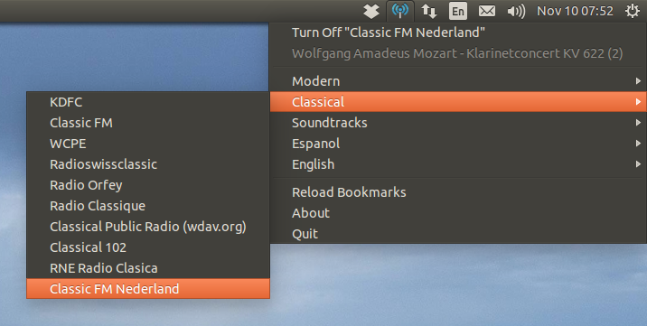

### About
```radiotray-lite``` is a lightweight clone of the original [Radio Tray](http://radiotray.sourceforge.net/) online radio streaming player rewritten in C++.



### Key features
* Runs on a Linux system tray.
* Has minimum interface possible.
* Plays most media formats (it uses gstreamer).
* Supports PLS, M3U, ASX, RAM, XSPF playlists.

### Build
For a while this project is only tested on Ubuntu (14.04 and 16.04 versions). In order to build it you need to have
installed ```-dev``` versions of the following packages:
* ```libgtkmm-3.0```
* ```libgstreamermm-0.10-2``` or ```libgstreamermm-1.0```
* ```libcurl3```
* ```libnotify4```
* ```libappindicator3```

To compile program run following (with obvious amendments) commands from build directory:
* ```$ cmake /path/to/radiotray-lite/ -DCMAKE_INSTALL_PREFIX=/usr/```
* ```$ make```
* ```$ cpack -G DEB``` to create package in ```.deb``` format or ```$ cpack -G RPM``` to create package in ```.rpm``` format.

Package will be created in the ```packages``` folder of the build directory.

### Configs
Copy your existing ```bookmarks.xml``` from [Radio Tray](http://radiotray.sourceforge.net/) (which is usually located at
```$HOME/.local/share/radiotray/bookmarks.xml```) into ```$HOME/.config/radiotray-lite/``` directory.

### Licensing
See [LICENSE.md](LICENSE.md) file for license information.
